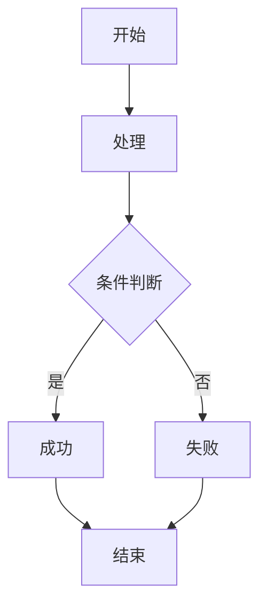
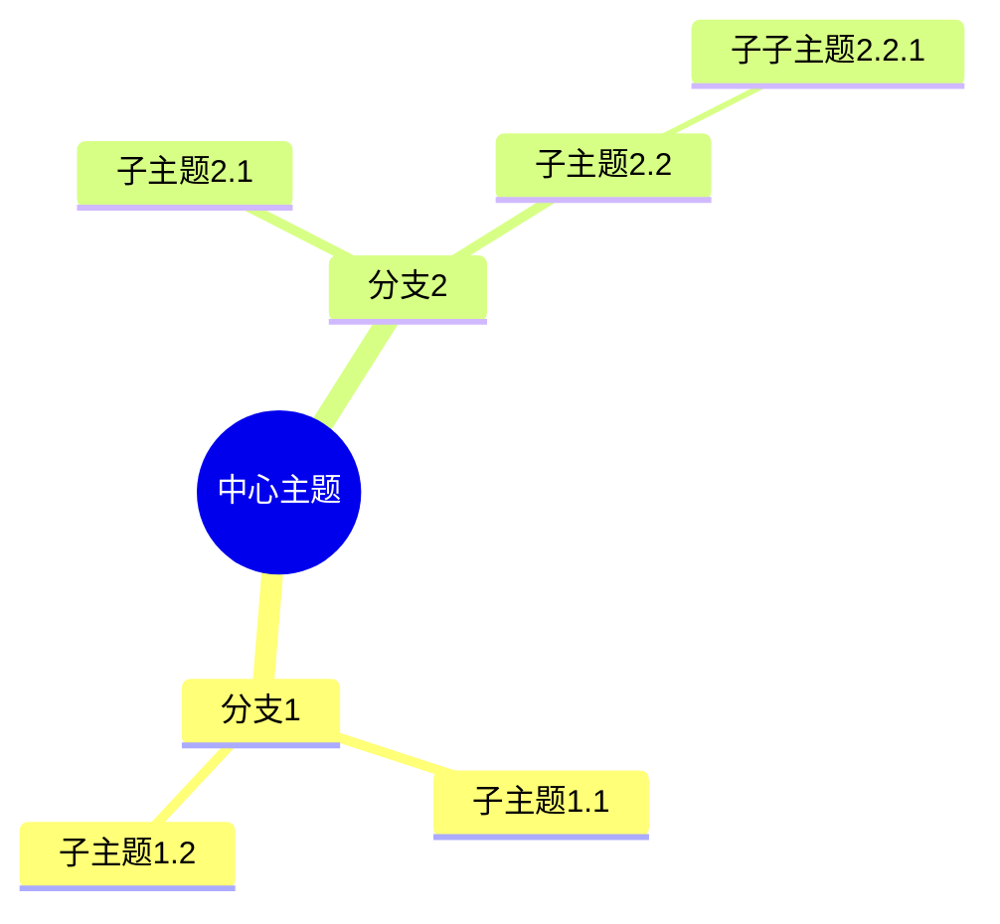

# 测试导入文件

## Mermaid图表示例

```mermaid
graph TD
    A[开始] --> B[处理]
    B --> C{条件判断}
    C -->|是| D[成功]
    C -->|否| E[失败]
    D --> F[结束]
    E --> F
```

## 无序列表示例

- 根节点
  - 子节点1
    - 孙节点1-1
    - 孙节点1-2
  - 子节点2
    - 孙节点2-1
  - 子节点3

## 思维导图示例

```mermaid
mindmap
  root((中心主题))
    分支1
      子主题1.1
      子主题1.2
    分支2
      子主题2.1
      子主题2.2
        子子主题2.2.1
```